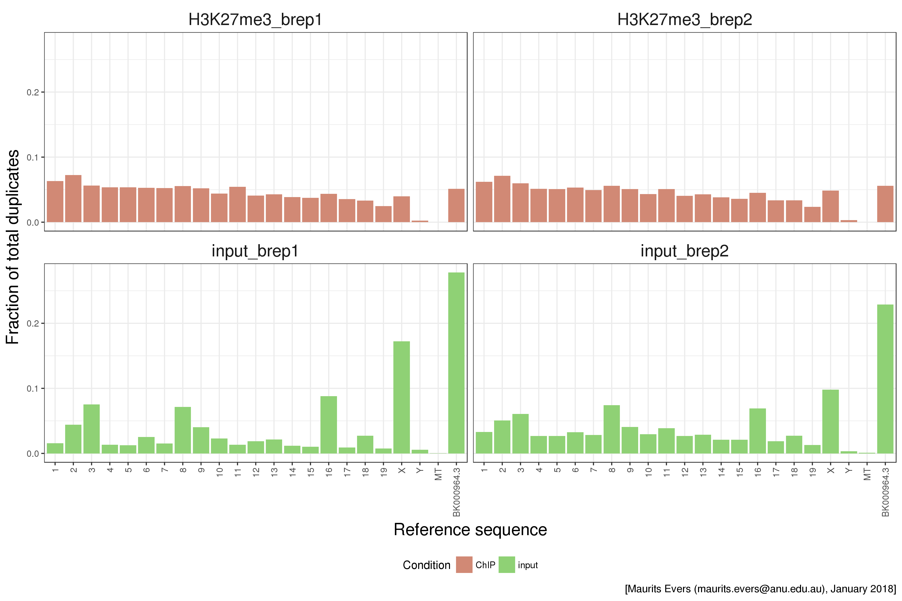

<script type="text/x-mathjax-config">
MathJax.Hub.Config({
  CommonHTML: {
    scale: 130
  }
});
</script>


```{r echo=FALSE}
# knitr options
knitr::opts_chunk$set(echo = FALSE)

# Load libraries
suppressMessages(library(DT));           # Interactive datatables
```

## Alignment summary stats
```{r echo=FALSE}
df <- read.delim("../../analysis/GRCm38+rDNA_repeat/alignment_stats.tsv");
df$Sample <- gsub("(bowtie2_GRCm38\\+rDNA_repeat_|.log)", "", df$Sample);
df$Condition <- ifelse(
    grepl("UBF", df[, 1]),
    "ChIP",
    "Input");
DT::datatable(df,
    options = list(
        pageLength = 10,
        dom = "fti",
        order = list(list(0, "asc")),
        scrollX = TRUE),
    rownames = FALSE);
```


## Read duplication metrics
```{r echo=FALSE}
df <- read.delim(
    "../../analysis/GRCm38+rDNA_repeat/picard-tools_MarkDuplicates_stats.tsv");
df$Sample <- gsub(".txt", "", df$Sample);
df$Condition <- ifelse(
    grepl("UBF", df[, 1]),
    "ChIP",
    "Input");
DT::datatable(df,
    options = list(
        pageLength = 10,
        dom = "fti",
        order = list(list(0, "asc")),
        scrollX = TRUE),
    rownames = FALSE);
```


## Read coverage per bp per ref seq per sample
<p style="margin-top:-2em" align="center">

</p>


## Read coverage per bp per ref seq per sample
```{r echo=FALSE}
df <- read.csv(
    "../../analysis/GRCm38+rDNA_repeat/samtools/bedcov/coverage_per_bp.csv");
DT::datatable(df,
    options = list(
        pageLength = nrow(df),
        dom = "fti",
        scrollX = TRUE,
        scrollY = "400px"),
    rownames = FALSE);
```


## Duplication as fraction of total duplicate reads
<p style="margin-top:-2em" align="center">

</p>


## Duplication per kb (DPK)
<p style="margin-top:-2em" align="center">

</p>


## PCA based on genome coverage
<p style="margin-top:-2em" align="center">

</p>


## Fingerprint plot 1
<p align="center">

</p>
<p style="font-size:50%" align="right"> [[http://deeptools.readthedocs.io/en/latest/content/tools/plotFingerprint.html]](http://deeptools.readthedocs.io/en/latest/content/tools/plotFingerprint.html)</p>


## Fingerprint plot 2
<p style="margin-top:-2em" align="center">

</p>


## Meta-gene score profile
<p style="margin-top:-2em" align="center">

</p>


## Results and conclusion
